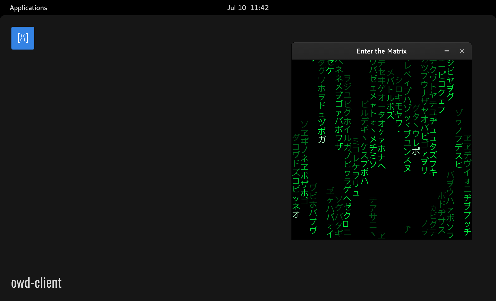

# Matrix Rain for OWD Client
> The OWD module to enter the Matrix, made with p5.js

<p>
    
</p>

<p>
    <a href="https://github.com/MatiTea/owd-matrix-rain/blob/main/LICENSE"></a>
    <a href="https://github.com/owdproject/owd-client"></a>
    <a href="https://github.com/topics/owd-modules"></a>
</p>

## Features
- Display a Matrix Digital Rain in your OWD client
- Set the speed of the rain
- Drag horizontally to set the hue of the streams according to your mood

## Quick install
- Move to your client folder, then
  ```
  # Install this module with Npm
  npm install https://github.com/MatiTea/owd-app-matrix-rain
  
  # Or using Yarn
  yarn add https://github.com/MatiTea/owd-app-matrix-rain
  ```
- Define this module in `owd-client/client.extensions.ts`
  ```js
  import AboutModule from "@owd-client/core/src/modules/app/about";
  import DebugModule from "@owd-client/core/src/modules/app/debug";
  import MatrixRain from "owd-app-matrix-rain/client";

  export default {
    app: {
      modules: [
        AboutModule,
        DebugModule,
        MatrixRain,
      ]
    },
    ...
  ```
- Copy the content of the [client/config](https://github.com/MatiTea/owd-app-matrix-rain/tree/master/client/config) folder into `owd-client/config`

## Configuration
Edit the `config/matrix-rain/config.json` file
- #### Set the rain speed
    Choose a number to increase or decrease the speed multiplier
- #### Set the default streams hue
    Choose a value between 0 and 360 to set the default hue of the streams
- #### Enable/disable the draggableHue function
    Set the value `true` or `false`

## Dependencies
- p5

## Compatibility
- Open Web Desktop client v2.0.0-beta.2

## License
This project is released under the [MIT License](LICENSE)